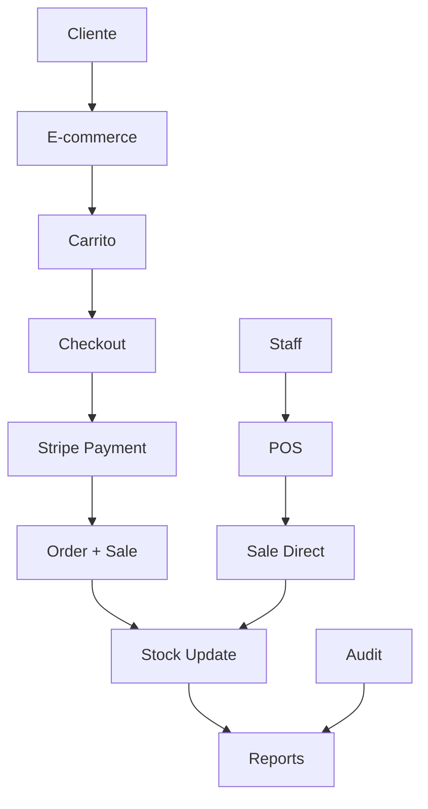

# UPN-RossCrafts

Sistema integral de E-commerce y POS para Ross Crafts - Proyecto Capstone UPN

[](https://www.djangoproject.com/)
[](https://www.python.org/)
[](https://www.microsoft.com/sql-server/)
[](https://stripe.com/)

## 📋 Descripción del Proyecto

Ross Crafts es un sistema completo de gestión empresarial que integra:
- **E-commerce** con carrito de compras y pagos online
- **Punto de Venta (POS)** para ventas presenciales
- **Gestión de inventario** con control automático de stock
- **Sistema de reportes** con dashboard ejecutivo
- **Gestión de clientes y proveedores**
- **Auditoría completa** de operaciones

**Desarrollado como proyecto Capstone para la Universidad Privada del Norte (UPN)**

## 🚀 Características Principales

### 💼 Sistema Dual de Usuarios
- **Staff**: Empleados, Administradores y Gerentes con roles específicos
- **Clientes**: Sistema independiente para usuarios de la tienda online

### 🛒 E-commerce Completo
- Catálogo de productos con filtros avanzados
- Carrito de compras persistente (sesión + usuario)
- Checkout en 3 pasos con validación
- Integración completa con Stripe para pagos
- Gestión de pedidos y seguimiento

### 🏪 Punto de Venta (POS)
- Interfaz optimizada para ventas rápidas
- Búsqueda de productos en tiempo real
- Cálculo automático de impuestos
- Generación de comprobantes PDF
- Control de stock en tiempo real

### 📊 Dashboard y Reportes
- KPIs en tiempo real con gráficos interactivos
- Reportes de ventas, stock y clientes
- Exportación a PDF y Excel
- Análisis de tendencias y comportamiento

### 🔐 Seguridad y Auditoría
- Control de acceso basado en roles
- Auditoría completa de operaciones
- Rate limiting en autenticación
- Validación de integridad de datos

## 🛠️ Stack Tecnológico

### Backend
- **Python 3.12+** - Lenguaje principal
- **Django 4.2+** - Framework web
- **SQL Server Express** - Base de datos con autenticación Windows
- **ODBC Driver 17** - Conector de base de datos

### Frontend
- **HTML5/CSS3** - Estructura y estilos
- **Bootstrap 5** - Framework CSS responsivo
- **JavaScript ES6+** - Interactividad
- **Chart.js** - Gráficos interactivos
- **Stripe.js** - Procesamiento de pagos

### Herramientas y Librerías
- **ReportLab** - Generación de PDFs
- **openpyxl** - Exportación a Excel
- **Pillow** - Procesamiento de imágenes
- **django-ratelimit** - Control de tasa de requests
- **whitenoise** - Servir archivos estáticos

## 📦 Instalación y Configuración

### Prerrequisitos
- Python 3.12 o superior
- SQL Server Express (con autenticación Windows)
- ODBC Driver 17 for SQL Server
- Git (para clonar el repositorio)

### Pasos de Instalación

1. **Clonar el repositorio:**
```bash
git clone https://github.com/laynes-echavez/UPN-RossCrafts.git
cd UPN-RossCrafts
```

2. **Crear entorno virtual:**
```bash
python -m venv venv
# Windows
venv\Scripts\activate
# Linux/Mac
source venv/bin/activate
```

3. **Instalar dependencias:**
```bash
pip install -r requirements.txt
```

4. **Configurar variables de entorno:**
```bash
cp .env.example .env
# Editar .env con tus configuraciones específicas
```

5. **Crear base de datos:**
```sql
-- Ejecutar en SQL Server Management Studio
CREATE DATABASE ross_crafts_db COLLATE Modern_Spanish_CI_AS;
GO
USE ross_crafts_db;
GO
```

6. **Ejecutar migraciones:**
```bash
python manage.py makemigrations
python manage.py migrate
```

7. **Crear datos iniciales:**
```bash
# Crear superusuario
python manage.py createsuperuser

# Cargar datos de prueba (opcional)
python manage.py loaddata apps/stock/fixtures/initial_categories.json
python manage.py loaddata apps/authentication/fixtures/test_users.json
```

8. **Ejecutar servidor de desarrollo:**
```bash
python manage.py runserver
```

9. **Acceder al sistema:**
- **Admin/Staff**: http://localhost:8000/auth/login/
- **Tienda**: http://localhost:8000/
- **Admin Django**: http://localhost:8000/admin/

## 🏗️ Arquitectura del Sistema

### Módulos del Sistema

```
apps/
├── authentication/     # 🔐 Gestión de usuarios staff y roles
├── stock/             # 📦 Productos, categorías y control de inventario
├── customers/         # 👥 Gestión de clientes (independiente del staff)
├── suppliers/         # 🏭 Proveedores y órdenes de compra
├── sales/            # 💰 Ventas presenciales (POS)
├── ecommerce/        # 🛒 Tienda online y autenticación de clientes
├── payments/         # 💳 Procesamiento de pagos con Stripe
├── reports/          # 📊 Dashboard y reportes ejecutivos
└── audit/            # 📋 Registro de auditoría y logs
```

### Flujo de Datos Principal



## 📱 Funcionalidades por Módulo

### ✅ Sistema de Autenticación (Staff)
- Login/Logout con rate limiting
- Control de acceso por roles (Gerente, Administrador, Empleado)
- Middleware de auditoría
- Dashboard redirect según rol
- Ver: `AUTENTICACION_COMPLETADA.md` y `GUIA_USO_AUTENTICACION.md`

### ✅ Gestión de Productos y Stock
- CRUD completo de productos y categorías
- Control de stock con movimientos automáticos
- Importación desde Excel
- Alertas de stock bajo
- Búsqueda AJAX
- Ver: `STOCK_COMPLETADO.md`

### ✅ Gestión de Clientes
- CRUD completo de clientes
- Validaciones (DNI, email, teléfono)
- Búsqueda AJAX para POS
- Exportación a Excel
- Perfil con historial de compras
- Ver: `CUSTOMERS_COMPLETADO.md`

### ✅ Gestión de Proveedores
- CRUD completo de proveedores
- Órdenes de compra
- Seguimiento de estado
- Ver: `SUPPLIERS_COMPLETADO.md`

### ✅ Punto de Venta (POS)
- Vista única de dos columnas
- Búsqueda de productos en tiempo real
- Carrito dinámico con AJAX
- Registro de ventas con validación de stock
- Generación de comprobantes PDF
- Cálculo automático de IGV (18%)
- Ver: `POS_COMPLETADO.md` y `GUIA_USO_POS.md`

### ✅ Sistema de Autenticación de Clientes (E-commerce)
- Registro e inicio de sesión independiente del staff
- Backend de autenticación personalizado (CustomerAuthBackend)
- Gestión de perfil y datos personales
- Historial de pedidos (online + presenciales)
- Cambio de contraseña
- Recuperación de contraseña por email
- Migración automática de carrito de sesión a cliente
- Email de bienvenida
- Ver: `ECOMMERCE_COMPLETADO.md` y `GUIA_USO_CLIENTES.md`

### ✅ Sistema de Pagos con Stripe
- Checkout en 3 pasos (Envío, Resumen, Pago)
- Integración completa con Stripe.js y Payment Intents API
- Webhook para confirmación automática de pagos
- Creación automática de pedidos y ventas
- Decremento automático de stock
- Email de confirmación HTML
- Páginas de éxito y cancelación
- Stepper visual de progreso
- Tarjetas de prueba para desarrollo
- Manejo de errores y seguridad (signature verification, idempotencia)
- Ver: `PAYMENTS_COMPLETADO.md` y `GUIA_USO_STRIPE.md`

### ✅ Sistema de Reportes y Dashboard
- Dashboard ejecutivo con KPIs en tiempo real
- Gráficos interactivos con Chart.js (ventas, productos, clientes)
- Reporte de ventas con filtros avanzados
- Reporte de stock con alertas de productos críticos
- Reporte de clientes con análisis de comportamiento
- Exportación a PDF (ReportLab) y Excel (openpyxl)
- APIs JSON para gráficos
- Control de acceso por roles
- Compatible con SQL Server (TruncDate)
- Ver: `REPORTS_COMPLETADO.md`

## 🧪 Validación del Sistema

El proyecto incluye un script de validación automática que verifica la integridad de todos los flujos:

```bash
python validate_system_flows.py
```

### Pruebas Incluidas:
- ✅ Sistema de usuarios y permisos
- ✅ Funcionamiento de señales de stock
- ✅ Sistema de carrito y cálculos
- ✅ Numeración única de comprobantes
- ✅ Integridad de claves foráneas
- ✅ Sistema de auditoría
- ✅ Consistencia de stock

## 📚 Documentación Adicional

- [`INSTALACION_COMPLETADA.md`](INSTALACION_COMPLETADA.md) - Guía completa de instalación
- [`FLUJOS_CORREGIDOS.md`](FLUJOS_CORREGIDOS.md) - Análisis técnico de correcciones
- [`RESUMEN_CORRECCIONES.md`](RESUMEN_CORRECCIONES.md) - Resumen ejecutivo de mejoras
- [`GUIA_USO_POS.md`](GUIA_USO_POS.md) - Manual del punto de venta
- Documentos específicos por módulo (`*_COMPLETADO.md`)

## 🎨 Diseño y UI/UX

### Paleta de Colores Ross Crafts
- **Dark**: #41431B (Verde oliva oscuro)
- **Medium**: #AEB784 (Verde oliva medio)
- **Light**: #E3DBBB (Beige claro)
- **Cream**: #F8F3E1 (Crema)

### Principios de Diseño
- **Responsivo**: Compatible con desktop, tablet y móvil
- **Accesible**: Cumple estándares de accesibilidad web
- **Intuitivo**: Navegación clara y flujos optimizados
- **Consistente**: Componentes reutilizables y patrones uniformes

## 🌐 URLs Principales

### Sistema Administrativo (Staff)
| Ruta | Descripción | Roles |
|------|-------------|-------|
| `/auth/login/` | Login de empleados | Todos |
| `/dashboard/` | Dashboard ejecutivo | Gerente, Admin |
| `/dashboard/pos/` | Punto de venta | Todos |
| `/stock/productos/` | Gestión de productos | Admin, Gerente |
| `/clientes/` | Gestión de clientes | Admin, Gerente |
| `/suppliers/` | Gestión de proveedores | Admin, Gerente |
| `/reports/` | Reportes y analytics | Gerente, Admin |

### E-commerce (Clientes)
| Ruta | Descripción |
|------|-------------|
| `/` | Página de inicio |
| `/tienda/` | Catálogo de productos |
| `/carrito/` | Carrito de compras |
| `/checkout/` | Proceso de compra |
| `/cuenta/login/` | Login de clientes |
| `/cuenta/registro/` | Registro de clientes |
| `/cuenta/perfil/` | Perfil del cliente |
| `/cuenta/mis-pedidos/` | Historial de pedidos |

## 🔧 Configuración Avanzada

### Variables de Entorno (.env)
```env
# Base de datos
DB_NAME=ross_crafts_db
DB_HOST=SERVIDOR\SQLEXPRESS01

# Stripe (Pagos)
STRIPE_PUBLIC_KEY=pk_test_...
STRIPE_SECRET_KEY=sk_test_...
STRIPE_WEBHOOK_SECRET=whsec_...

# Email
EMAIL_HOST_USER=tu-email@gmail.com
EMAIL_HOST_PASSWORD=tu-app-password

# Seguridad
SECRET_KEY=tu-secret-key-muy-segura
DEBUG=True
ALLOWED_HOSTS=localhost,127.0.0.1
```

### Configuración de Producción
```python
# settings/production.py
DEBUG = False
SECURE_SSL_REDIRECT = True
SESSION_COOKIE_SECURE = True
CSRF_COOKIE_SECURE = True
```

## 🚀 Despliegue

### Preparación para Producción
1. **Configurar variables de entorno de producción**
2. **Ejecutar collectstatic**: `python manage.py collectstatic`
3. **Configurar servidor web** (IIS, Apache, Nginx)
4. **Configurar base de datos de producción**
5. **Configurar SSL/TLS**
6. **Configurar backups automáticos**

### Monitoreo Recomendado
- **Logs**: Revisar `logs/errors.log` y `logs/activity.log`
- **Performance**: Monitorear tiempo de respuesta
- **Stock**: Alertas automáticas de productos críticos
- **Pagos**: Verificar webhook de Stripe

## 👥 Equipo de Desarrollo

**Proyecto Capstone - Universidad Privada del Norte (UPN)**

- **Desarrollador Principal**: [Tu Nombre]
- **Asesor Académico**: [Nombre del Asesor]
- **Institución**: Universidad Privada del Norte
- **Programa**: [Tu Programa Académico]

## 📄 Licencia

Este proyecto es desarrollado como trabajo académico para la UPN. Todos los derechos reservados.

## 🤝 Contribuciones

Este es un proyecto académico. Para sugerencias o mejoras:

1. Fork el repositorio
2. Crea una rama para tu feature (`git checkout -b feature/nueva-funcionalidad`)
3. Commit tus cambios (`git commit -am 'Agregar nueva funcionalidad'`)
4. Push a la rama (`git push origin feature/nueva-funcionalidad`)
5. Crea un Pull Request

## 📞 Soporte

Para soporte técnico o consultas académicas:
- **Email**: [tu-email@upn.edu.pe]
- **Issues**: [GitHub Issues](https://github.com/laynes-echavez/UPN-RossCrafts/issues)

---

**🎓 Desarrollado con ❤️ para la Universidad Privada del Norte**
